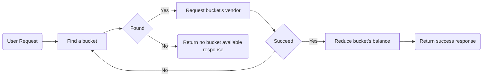

# Story
The main point of this project is creating a virtual card via a vendor (provider) with an REST API.
Every virtual card is related to a bucket.
## Bucket System
We can think bucket like a bank account. We store our money into buckets.
The properties of a single bucket are;
 
|Column|Description|
|--|--|
|startDate|The first day that we can start to use this bucket's balance|
|endDate|The last day that we can start to use this bucket's balance|
|balance|Available balance of this bucket|
|currency|The currency of the bucket. Default is: **USD**|
|vendor|The vendor that this bucket related to|

## Vendor

Vendors are our providers. We can think them like banks. When user wants to create a virtual card we're sending a request to vendor. If the vendor accepts the creation of the virtual card then we create the virtual card.
Column|Description|
-- | -- 
bucketLimit|Vendor's buckets are creating with fixed balance. This field stores the fixed balances|
bucketDateDelta|Vendor's buckets are creating with fixed date delta. Date delta means the day count between start and end date.|

**Exceptions**
When a virtual card creation requested and the vendor (that we sent a create request) rejects or returns exception, we try to create this virtual card with another available vendor.
Example:

|Vendor's Name|Returned status| Description |
|--|--|--|
|Lion|503 (Service unavailable)|It means we couldn't create the virtual card try another vendor|
|Bear|200 (Success)|We created the virtual card|

## Virtual Card
Virtual card is the main item of this project. We're trying to create a single virtual card using buckets and vendors.
The basic flow to create a virtual card:

When an user request to create virtual card, the requested balance will substract from chosed bucket. (Read below to know how we're choosing the buckets).

**Bucket choosing**
When user requests to create virtual card, we try to find single bucket to create this virtual card. Conditions are;

 - Start date **must** before then virtual card's
 - Expire date **must** after then virtual card's end date
 - The bucket that has biggest balance will choose

